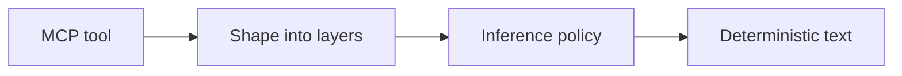

# Epistemic Envelope — Keep certified, observed, and inferred claims apart

[](https://github.com/ovaledge/epistemic-envelope/actions/workflows/ci.yml)
[](LICENSE)
[](https://pypi.org/project/epistemic-envelope/)


## Why

Data tools mix a rule that passed, a measurement from last year, and a model's guess in one paragraph. Agents then repeat the guess as if someone certified it. This library keeps those three kinds of claim in separate layers, for catalog teams that expose data through MCP tools.

## Quickstart

```bash
uv run python -m examples.catalog_server
```

That starts the reference catalog server on stdio and waits for an MCP client. `EPIENV_INFERENCE=off` withholds AI inferences.

## How it works



A tool returns catalog facts. The decorator places approved rule results in certified findings, profiler metrics in observations, and model text in AI inferences. Policy can drop the inferences. The rendered text names the layer of every line.

## Results / example output

`describe_asset` for fixture column `col_email`, from the reference server:

```text
## Certified findings (authoritative)
- [cf-1] Email format rule passed — rule DQ-17, pass, certified by steward_a on 2026-09-20
## Profiling observations (measured; may be stale)
- [po-1] null_pct = 0.02 (observed 2026-09-20, run pr_9)
## AI inferences (unverified; do not present as fact)
- [ai-1] Likely contains personal email addresses — model static/canned, based on [po-1], review: unreviewed
Governance notice: AI-generated content is unverified and not certified.
```

## Design decisions

- [FastMCP integration](docs/adr/0001-fastmcp-integration.md)
- [Level 1 rule mapping](docs/adr/0002-level-1-rule-mapping.md)
- [OpenMetadata endpoint paths](docs/adr/0003-openmetadata-endpoints.md)

## Roadmap

- A recorded demo GIF (the image above is a placeholder)
- An MCP Governance Auditor report for this server
- A decision on whether the curated layer ships
- Name and IP clearance
- A live check of the OpenMetadata paths

## Licence

Code is Apache-2.0. The specification text is CC BY 4.0.
